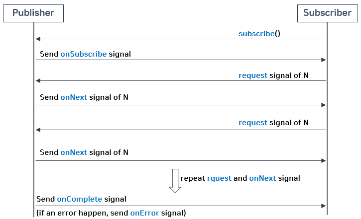

# Back Pressure

Publisher에서 emit되는 데이터를 Subscriber쪽에서 안정적으로 처리하기 위한 제어 기능

- 요청 데이터의 갯수를 제어하는 방법
  - Subscriber가 처리할 수 있는 수준의 데이터 갯수를 Publisher에게 요청
  - 위 그림에서 request(n)에 해당한다
- Reactor에서 제공하는 방법
  - IGNORE
    - back pressure를 적용하지 않는 것
  - ERROR
    - Downstream으로 전달할 데이터가 buffer에 가득 찰 경우, 예외를 발생 시킴
  - DROP
    - Downstream으로 전달한 데이터가 buffer에 가득 찰 경우, 대기하는 데이터 중 먼저 emit된 데이터 부터 drop
  - LATEST
    - Downstream으로 전달한 데이터가 buffer에 가득 찰 경우, 가장 최근에 emit된 데이터부터 buffer에 채움
    - Latest 이전 데이터는 discard(폐기) 됨
  - BUFFER
    - Downstream으로 전달한 데이터가 buffer에 가득 찰 경우, buffer안에 있는 데이터를 drop
    - DROP-LATEST
      - 버퍼가 가득차고 그 이후에 버퍼에 들어온 가장 최근 데이터가 DROP
    - DROP-OLDEST
      - 버퍼가 가득차고 그 이후에 버퍼에 들어오면 가장 오래된 데이터가 DROP