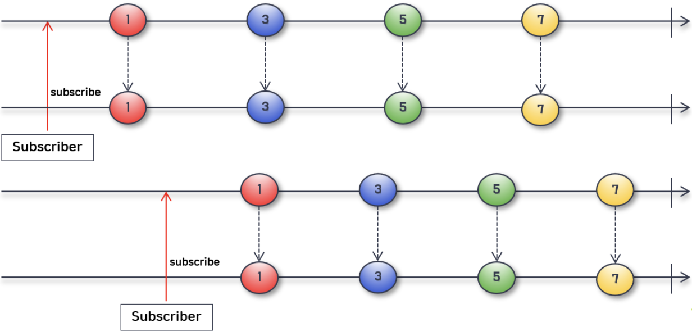
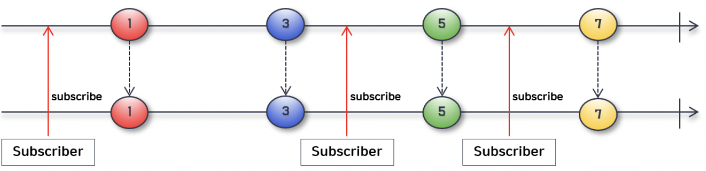

# Sequence

## Cold Sequence

- Subscriber가 subscribe()를 호출할 때마다 데이터를 처음부터 다시 생성하여 emit
  - 즉, 구독할 떄 마다 처음부터 emit된 모든 데이터를 받을 수 있다
  - 구독 시점이 다르더라도 동일한 데이터를 받을 수 있다
- 구독을 할 때마다 sequence timeline이 계속 생성

## Hot Sequence

- Subscriber가 subscribe()를 호출할 때, 이전의 emit된 데이터는 받지 못함
  - 즉, 구독한 시점의 타임라인부터 emit된 데이터를 받을 수 있다
  - 구독 시점에 따라 받는 데이터가 달라진다
- 하나의 sequence timeline을 공유한다

