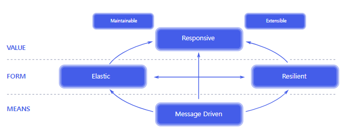

# Reactive

## 리액티브 시스템과 리액티브 프로그래밍의 의미

### 리액티브 시스템

<p align="center"></p>

- 응답성(Responsive) 
  - 사용자의 요청에 대해 즉각적으로 응답할 수 있어야 한다
- 회복성(Resilient)
  - 시스템의 일부가 실패하더라도 시스템은 계속해서 응답성을 유지해야 한다
- 유연성(Elastic)
  - 시스템의 부하가 증가하거나 감소하더라도 시스템은 계속해서 응답성을 유지해야 한다
- 메시지 주도(Message Driven)
  - 비동기 메시지 전달을 통해 컴포넌트 사이의 느슨한 결합, 격리성, 위치 투명성을 유지해야 한다

### 리액티브 프로그래밍

- 리액티브 시스템을 구축하는데 필요한 프로그래밍 모델
- 특징
  - 데이터 소스의 변경이 있을 때마다 데이터를 전파
  - 선언형 프로그래밍 패러다임
    - 실행할 동작을 구체적으로 명시하지 않고 목표만 정의
  - 함수형 프로그래밍 기법

#### 명령형 vs 선언형 프로그래밍

- 명령형
```java
public class ImperativeProgramming {
    public static void main(String[] args) {
        List<Integer> numbers = Arrays.asList(1, 3, 21, 10, 8, 11, 4, 5, 6, 7, 9);
        int sum = 0;
        for (int number : numbers) {
            if(number > 6 && number % 2 != 0) {
              sum += number;
            }
        }
    }
}
```

- 선언형
```java
public class DeclarativeProgramming {
    public static void main(String[] args) {
        List<Integer> numbers = Arrays.asList(1, 3, 21, 10, 8, 11, 4, 5, 6, 7, 9);
        int sum = numbers.stream()
                .filter(number -> number > 6 && number % 2 != 0)
                .mapToInt(number -> number)
                .sum();
    }
}
```

### 리액티브 스트림즈

- 리액티브 프로그래밍을 위한 표준
  - Publisher
  - Subscriber
  - Subscription
  - Processor
- 리액티브 스트림즈를 구현한 구현체
  - RxJava
  - Flow API
  - Akka Streams
  - Reactor
  - 기타 등등