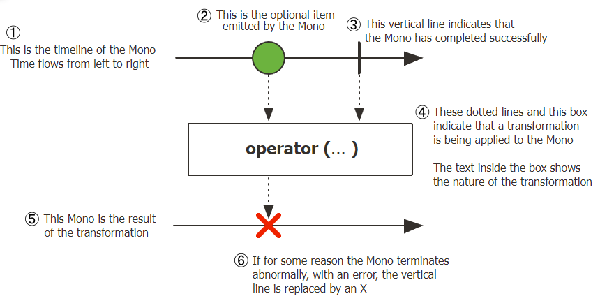
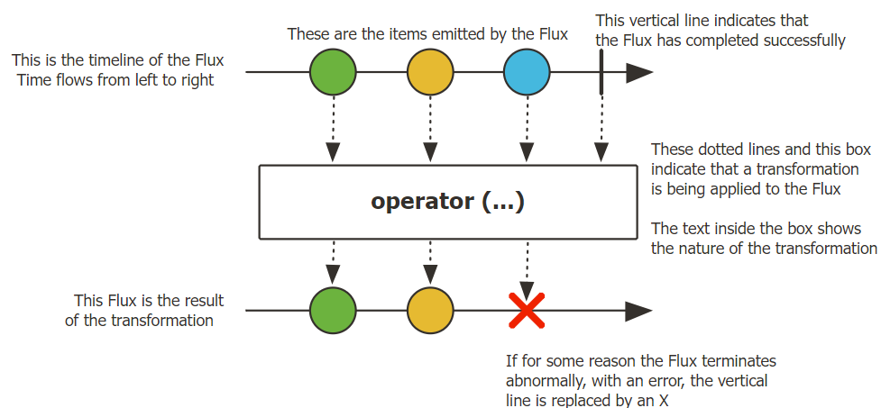

# Reactor

- 리액티브 프로그래밍을 위한 리액티브 라이브러리
- Reactive Streams 스펙을 구현한 구현체
- Reactive Stack의 기반이되며, Spring Webflux의 프레임워크에 포함되어 있음
- 특징
  - Fully Non-Blocking
  - 시퀀스
    - Flux[N]
    - Mono[0|1]
  - Backpressure ready network

## 구성 요소

- 생산자
  - Flux, Mono
- 데이터 생성 연산자
  - just(), from(), interval(), range(), repeat(), ...
- 데이터 소스
  - 생산자에서 생성하는 데이터
- 시퀀스
  - 데이터를 생성하여 소비자가 소비할 수 있도록 정의하는 것
- 소비자
  - subscribe() 내의 파라미터로 전달되는 부분

```java
public class ReactorIntro {
    public static void main(String[] args) {
        Flux<String> sequence = Flux.just("Hello", "World");
        sequence
                .map(data -> data.toLowerCase())
                .subscribe(data -> System.out.println(data));
    }
}
```

### 용어 정의

- Publisher
  - 발행자, 게시자, 생산자, 방출자(emitter)
- Subscriber
  - 구독자, 소비자
- Emit
  - Publisher가 데이터롤 내보내는 것
  - 방출, 통지, 내보내다
- Sequence
  - Publisher가 emit하는 데이터의 연속적인 흐름을 정의한 것
  - 연산자(Operator) 체인 형태로 정의
- Subscribe
  - Subscriber가 Sequence를 구독하는 것
- Dispose
  - Subscriber가 Sequence의 구독을 해지하는 것

## Mono & Flux

### Mono

<p align="center"></p>

- 0개 또는 1개의 데이터를 emit하는 Publisher
- 데이터를 emit하는 과정에서 에러가 발생하면 onError signal을 emit
  - signal이란 이벤트를 발생시키기 위한 어떤 메서드의 호출

### Flux

<p align="center"></p>

- 0개에서 N개의 데이터를 emit하는 Publisher
- Mono와 마찬가지로 데이터를 emit하는 과정에서 에러가 발생하면 onError signal을 emit

