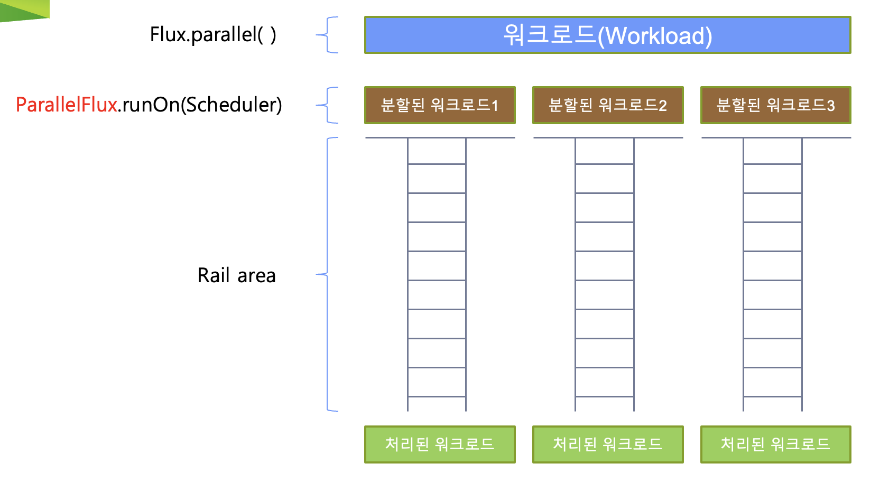

# Scheduler를 위한 전용 오퍼레이터

일반적으로 publishOn이나 subScribeOn을 사용하지 않는다면, operator chain은 
subscribe()가 호출되는 쓰레드와 동일한 쓰레드에서 실행된다.

## Parallel()

Downstream에 대한 데이터 처리를 병렬로 실행하기 위한 쓰레드를 지정한다.

### ParallelFlux

## PublishOn()

operator chain에서 downstream operator(코드 상 publishOn을 기준으로 아래 쪽에 있는 operator들)의 실행을 위한 쓰레드를 지정한다.

- publishOn()이 호출되면, 다음 publishOn()이 호출되기 전까지의 operator chain은 지정된 쓰레드에서 실행된다.
- subscribe()에 파라미터로 전달되는 내부의 동작 또한 지정된 쓰레드에서 동작한다 

## SubscribeOn()

최상위 upstream publisher 실행을 위한 쓰레드를 지정한다.

- 원본 데이터 소스를 emit하기 위한 스케쥴러를 지정
- publishOn을 추가로 설정하지 않는다면, operator chain 모두 subscribeOn에서 지정한 스케쥴러에서 실행된다.
- subscribeOn()이 publishOn()보다 늦게 호출되더라도, 최상위 ustream publisher는 subscribeOn()에서 지정한 스케쥴러에서 실행된다.

## Scheduler의 종류

- Schedulers.immediate() 
  - 별도의 쓰레드를 추가 할당하지 않고, 현재 쓰레드에서 실행
- Schedulers.single()
  - 하나의 쓰레드를 재사용하는 방식
  - 저지연, 일회성 실행에 최적화되어 있음
- Schedulers.boundedElastic()
  - 쓰레드 풀(ExecutorService 기반)을 사용해 쓰레드를 재사용하는 방식
  - 쓰레드 풀의 크기는 CPU 코어의 수에 따라 자동으로 설정
    - 기본적으로 CPU 코어의 수 * 10
  - 긴 실행 시간을 가진 Blocking I/O 작업에 최적화되어 있음
- Schedulers.parallel()
  - 여러개의 쓰레드를 할당해서 동시에 작업을 수행
  - Non Blocking I/O 작업에 최적화
  - CPU 코어 수 만큼 쓰레드를 생성
- Schedulers.fromExecutorService()
  - 기존 ExecutorService를 사용해 쓰레드를 생성
  - 의미있는 식별자를 제공하기에 주로 metric에서 주로 사용
- Schedulers.newXXX()
  - 다양한 유형의 새로운 Scheduler를 생성할 수 있음
  - Scheduler의 이름을 직접 지정할 수 있다
